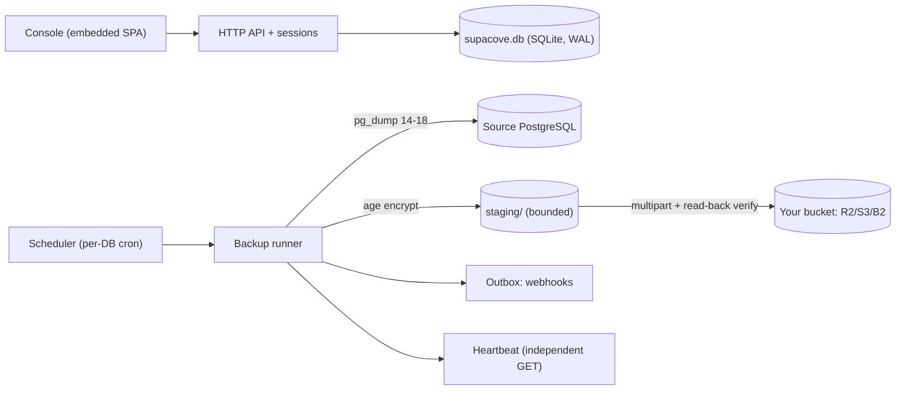

[English](README.md) | [简体中文](README.zh-CN.md)

# SupaCove

[](https://github.com/web-casa/supacove/releases)
[](https://github.com/web-casa/supacove/pkgs/container/supacove)

> **Platform-independent logical backups** for Supabase / Neon / Railway
> databases. Self-hosted single container; backups land in **your own** object
> storage (R2 / S3 / B2), age-encrypted, restorable with nothing but the
> ciphertext and an offline private key — no SupaCove component required.

Docs site: <https://supacove.com>. The project was originally called
`supabackup`; everything now ships under the `supacove` name (binary, image,
metric names, webhook headers — pre-rename names are served as equal-valued
aliases during the transition), and the `SB_*` environment prefix is kept.
Upgrading from a pre-rename deployment: see the
[upgrade notes](docs/deployment.md#upgrade-from-supabackup).

## Features

- **Logical backups**: official `pg_dump` (custom format) streamed through age
  encryption; client matrix 14–18 auto-matched to the source server major.
- **Three-volume metrics**: source physical size / dump archive / age
  ciphertext recorded per job (see [docs/capacity.md](docs/capacity.md)).
- **Restore verification** (optional): a throwaway embedded PostgreSQL
  instance performs a real restore plus manifest table-count check; a failed
  verification never marks a backup unusable, only flags it honestly.
  Requires explicit opt-in and the age identity (ADR-004; same UID, **not** a
  sandbox).
- **Recovery kits**: every successful backup ships a self-contained
  `restore.sh` (hash gate, non-empty-target refusal, password only via
  `PGPASSWORD`, table-count check) that runs on a bare host.
- **BYOS object storage**: R2 / S3 / B2 (S3-compatible) with forced read-back
  hash verification after upload and short-lived presigned downloads.
- **Retention anchors**: the newest and the last verified backup are never
  deleted by retention.
- **Scheduling & freshness**: per-database cron with timezones and
  staleness alerts; a four-state overview answers "which databases lack a
  fresh-enough success".
- **Notifications**: transactional outbox (retries/dedup/delivery state
  inspectable), webhooks, heartbeat monitoring (success pings are bound to
  remote commits and snapshot age; failures hit `/fail` immediately).
- **Observable**: authenticated `/metrics` with low-cardinality labels;
  audited: govulncheck 0 vulnerabilities (Go 1.26.9+), gitleaks clean,
  secret-canary regression tests on all four egress paths.

## Architecture at a glance



Full diagrams — components, the backup pipeline, both restore paths, the
notification flow, deployment topology and the upgrade state machine — live
in [docs/architecture.md](docs/architecture.md) and
[docs/deployment.md](docs/deployment.md).

## Quick start

Docker (image from GHCR, multi-arch, PG clients 14–18 included):

```bash
docker run -d -p 8080:8080 -v supacove-data:/app/data \
  ghcr.io/web-casa/supacove:latest
docker exec <container> /app/supacove bootstrap   # one-time admin token
```

Prefer binaries? Every `v*` tag attaches standalone archives
(linux/darwin × amd64/arm64, tar.gz + SHA256SUMS) to the
[GitHub Release](https://github.com/web-casa/supacove/releases) — the web
console and SQLite control plane are embedded; the only external dependency
is a local `pg_dump`:

```bash
./supacove serve && ./supacove bootstrap
```

> **Artifact timing**: `supacove_*` archives and the
> `ghcr.io/web-casa/supacove` image exist from the first post-rename
> release; the previously shipped `v0.1.0` artifacts carry the old
> (`supabackup`) names. On that tag the GHCR tags go live once the CI
> release jobs succeed, while the GitHub Release starts as a **draft**
> and becomes public when a maintainer publishes it. Until then, build
> from source (`make build` / `make image`) or install the old-named
> artifacts and follow the
> [upgrade notes](docs/deployment.md#upgrade-from-supabackup).

Install details, the pg_dump matrix and a systemd example:
[docs/deployment.md](docs/deployment.md).

## Docs

| Doc | Contents |
|---|---|
| [docs/architecture.md](docs/architecture.md) | Component, backup, restore and notification diagrams |
| [docs/deployment.md](docs/deployment.md) | Deployment, environment variables, verification, upgrade |
| [docs/disaster-recovery.md](docs/disaster-recovery.md) | Playbooks for four disaster classes (SQLite corruption / lost master key / bucket+key only / failed upgrade) |
| [docs/capacity.md](docs/capacity.md) | Measured performance, RPO semantics, scheduling bounds |
| [docs/dev-plan.md](docs/dev-plan.md) | Nine-phase development plan and protocol definitions |
| [docs/adr/](docs/adr/) | Architecture decision records |

## Explicitly out of scope (beta)

- PITR / WAL archiving (logical backups; see capacity.md for RPO semantics)
- One-click restore into production (restores are always deliberate,
  explicit operator actions)
- Backing up Supabase Auth/Storage **files** and Edge Function code
  (platform resources outside the database; data inside the auth/storage
  schemas IS covered, and the recovery kit states this honestly)

## Development

```bash
make dev          # dev environment (app + PostgreSQL + MinIO)
make check        # contract sync + lint + all tests
scripts/capacity-benchmark.sh   # capacity benchmark (needs Docker + host PG clients)
```

## License

[AGPL-3.0](LICENSE). Rationale in
[docs/adr/ADR-000-license.md](docs/adr/ADR-000-license.md).
