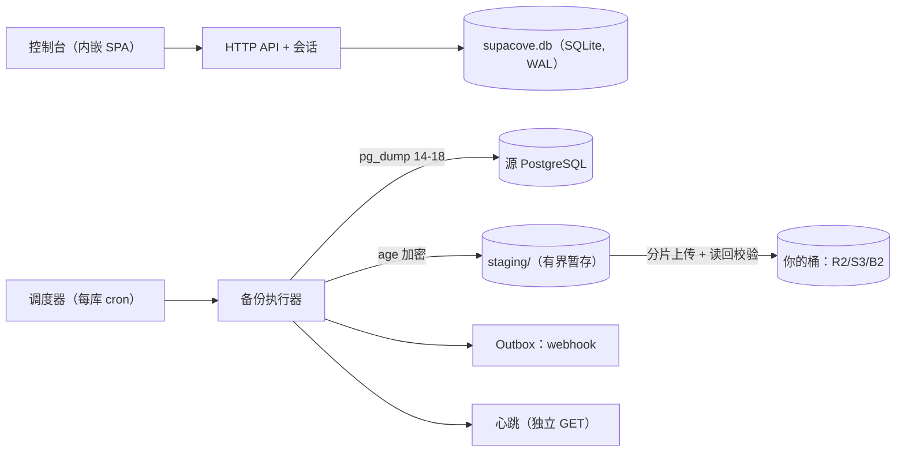

[English](README.md) | [简体中文](README.zh-CN.md)

# SupaCove

[](https://github.com/web-casa/supacove/releases)
[](https://github.com/web-casa/supacove/pkgs/container/supacove)

> 为 Supabase / Neon / Railway 数据库建立**独立于数据库平台的逻辑备份**。
> 自部署单容器，备份存入你自己的对象存储（R2 / S3 / B2），age 加密，
> 凭备份文件 + 离线私钥即可在**没有任何本工具组件**的情况下恢复。

文档站：<https://supacove.com>。本项目原名 supabackup，现已全量更名为
supacove：二进制、镜像（`ghcr.io/web-casa/supacove`）、指标名与 webhook
请求头都已使用新名（过渡期旧名作为等值别名并存）；`SB_*` 环境变量前缀
保持不变。从旧版本升级请先读
[升级须知](docs/deployment.md#upgrade-from-supabackup)。

## 功能

- **逻辑备份**：官方 `pg_dump`（custom 格式）流式 age 加密；客户端版本矩阵
  14–18，自动匹配源库 major。
- **三体积指标**：源库物理体积 / dump 归档 / age 密文，逐任务记录（容量
  报告见 [docs/capacity.md](docs/capacity.md)）。
- **恢复验证（可选）**：内嵌一次性 PostgreSQL 实例真实恢复 + manifest 表数
  核对，验证失败不影响备份可用性但如实标记。要求管理员显式启用并提供
  age 私钥（ADR-004；同 UID 运行，**不是沙箱**）。
- **恢复套件**：每个成功备份自动生成 `restore.sh`（哈希门槛、拒绝非空目标、
  密码只走 `PGPASSWORD`、表数核对），可在裸主机执行。
- **BYOS 对象存储**：R2 / S3 / B2（S3 兼容），上传后强制读回哈希校验，
  短期预签名下载。
- **保留锚点**：最新与最后验证通过的备份不被保留策略删除。
- **调度与新鲜度**：每库 cron + 时区 + 超期告警；overview 四态视图回答
  "哪些库没有足够新的成功备份"。
- **通知**：事务性 outbox（重试/去重/投递状态可查），webhook 事件，
  心跳监控（成功 ping 绑定远端提交与快照年龄，失败即时 `/fail`）。
- **可观测**：受认证保护的 `/metrics`（低基数标签），审计：govulncheck
  0 漏洞（Go 1.26.9+）、gitleaks 无泄漏、secret canary 四出口回归测试。

## 架构一览



完整图示（组件、备份流水线、两条恢复路径、通知链路、部署拓扑、升级
状态机）见 [docs/architecture.md](docs/architecture.md) 与
[docs/deployment.md](docs/deployment.md)。

## 快速开始

Docker（GHCR 多架构镜像，自带 PostgreSQL 客户端矩阵 14–18）：

```bash
docker run -d -p 8080:8080 -v supacove-data:/app/data \
  ghcr.io/web-casa/supacove:latest
docker exec <容器名> /app/supacove bootstrap   # 一次性管理员 token
```

也可以直接用 **GitHub Release** 的独立二进制（每个 `v*` 标签附带
linux/darwin × amd64/arm64 的 tar.gz + SHA256SUMS）：Web 控制台与 SQLite
控制面全部内嵌，唯一外部依赖是本机 `pg_dump`——

```bash
./supacove serve && ./supacove bootstrap
```

> **产物名时序**：`supacove_*` 归档与 `ghcr.io/web-casa/supacove` 镜像自
> 首个改名发布版本起提供；此前发布的 `v0.1.0` 使用旧名（`supabackup`）。
> 该 tag 触发后 GHCR 标签在 CI 发布 job 成功时即生效，GitHub Release 则先以
> **草稿**创建、维护者手工 publish 后才公开。在那之前试用请从源码构建
> （`make build` / `make image`），或安装旧名产物后按
> [升级须知](docs/deployment.md#upgrade-from-supabackup)完成升级。

安装步骤、pg_dump 版本矩阵与 systemd 示例见
[docs/deployment.md](docs/deployment.md)。

## 文档

| 文档 | 内容 |
|---|---|
| [docs/architecture.md](docs/architecture.md) | 架构、备份/恢复/通知流程图 |
| [docs/deployment.md](docs/deployment.md) | 部署、环境变量、恢复验证、升级 |
| [docs/disaster-recovery.md](docs/disaster-recovery.md) | 四类灾难场景的操作步骤（SQLite 损坏 / 主密钥丢失 / 仅剩桶+私钥 / 升级失败） |
| [docs/capacity.md](docs/capacity.md) | 实测性能数据、RPO 语义、调度规划边界 |
| [docs/dev-plan.md](docs/dev-plan.md) | 九阶段开发方案与协议定义 |
| [docs/adr/](docs/adr/) | 架构决策记录 |

## 明确不做（beta）

- PITR / WAL 归档（逻辑备份，见 capacity.md 的 RPO 语义）
- 一键恢复到生产库（恢复永远是你主动、显式的操作）
- 备份 Supabase Auth/Storage 的**文件**与 Edge Function 代码（数据库外的
  平台资源；auth/storage schema 内的数据在逻辑备份范围内，恢复套件里
  有如实声明）

## 开发

```bash
make dev          # 开发环境（应用 + PostgreSQL + MinIO）
make check        # 契约同步 + lint + 全部测试
scripts/capacity-benchmark.sh   # 容量基准（需 Docker + 宿主 PG 客户端）
```

## 许可证

[AGPL-3.0](LICENSE)。选择理由见 [docs/adr/ADR-000-license.md](docs/adr/ADR-000-license.md)。
