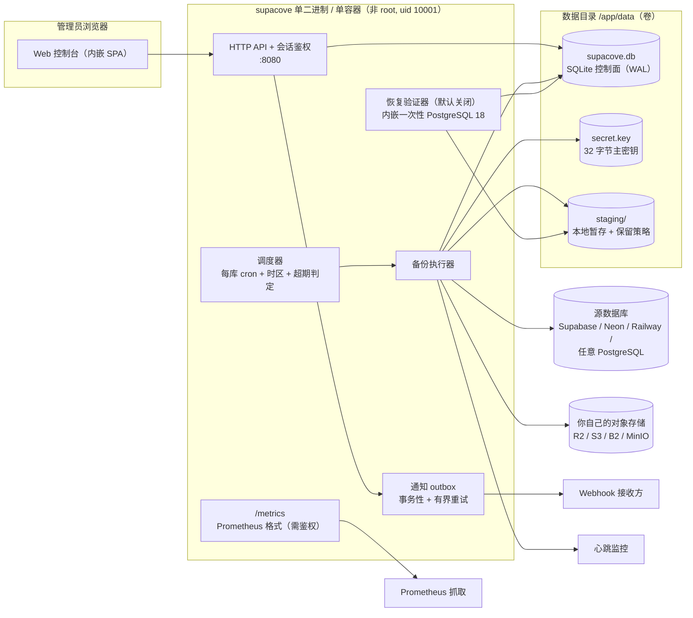
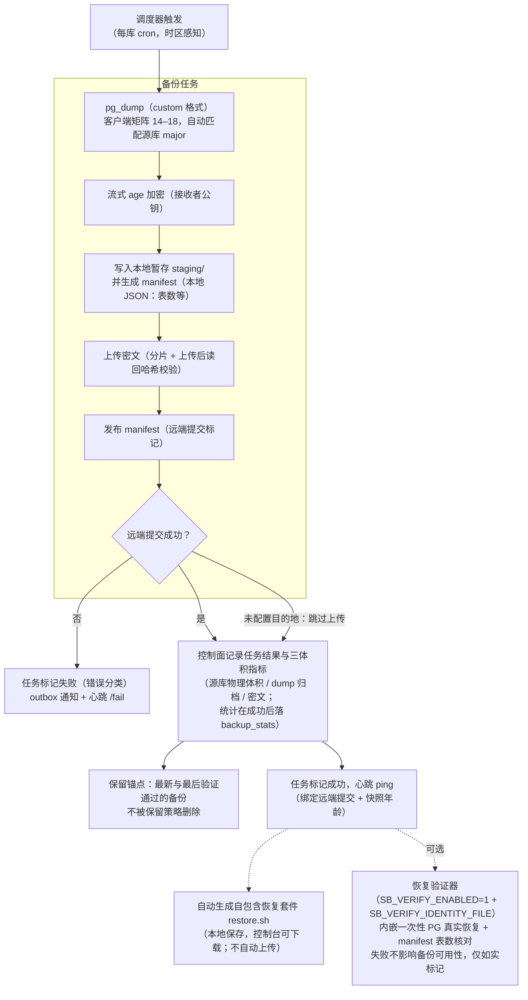
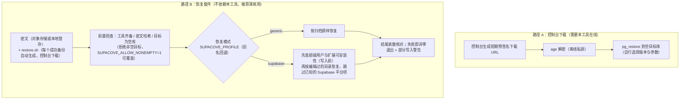
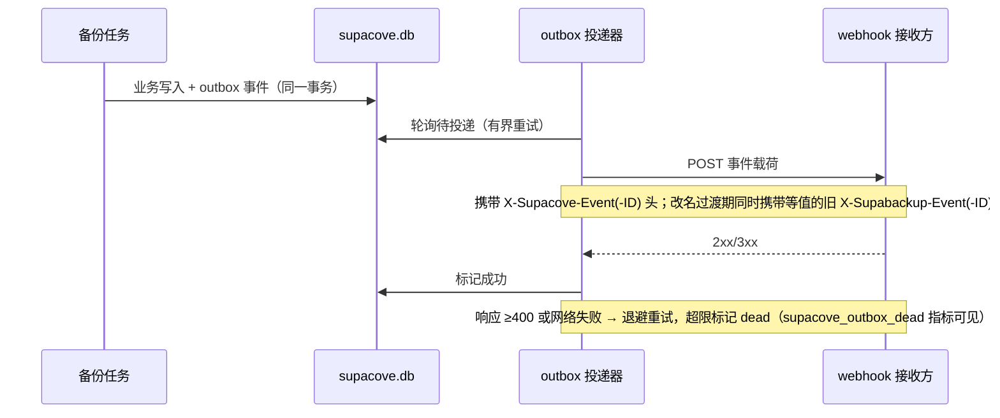

# SupaCove 架构

本文用图解释 SupaCove 的组成与关键流程：组件总览、一次备份的完整流水线、
两条恢复路径、通知链路。部署拓扑与升级状态机见
[deployment.md](deployment.md)（含图），灾难场景操作见
[disaster-recovery.md](disaster-recovery.md)。

## 1. 组件总览

SupaCove 是**单二进制**产品：Web 控制台（SPA）、HTTP API、SQLite 控制面、
调度器与备份执行器全部内嵌；对象存储与被备份的数据库都在你自己手里。

要点：

- **控制面数据**（数据库注册、凭据、任务、工件路径、outbox）全部在
  `supacove.db`；凭据用 `secret.key`（AES-GCM）加密后落库，密钥与库同目录。
- **两种交付形态**：图中 PG 客户端矩阵与 PG 18 服务端（恢复验证器用）是
  **容器镜像**自带的；独立二进制不内嵌任何 PostgreSQL 工具——备份需要
  宿主机安装 `pg_dump` 客户端（14–18），要启用验证器（`SB_VERIFY_ENABLED=1`
  且提供 `SB_VERIFY_IDENTITY_FILE`）还需 PostgreSQL 服务端。
- **备份工件不在本工具里长期保存**：配置了目的地时，本地 `staging/` 只做
  有界暂存（`SB_LOCAL_KEEP` 份数 + `SB_STAGING_QUOTA_BYTES` 配额，默认 0
  即不限；保留锚点可能使实际份数超过 `SB_LOCAL_KEEP`），最终归宿是你自己
  的对象存储。也可以**不配置任何目的地**：此时跳过上传，任务以"本地成功"
  结束（心跳对该例外有明确语义）。
- 出站请求（webhook、心跳、对象存储、源库连接）统一经过 SSRF 拨号边界
  （netguard），链路本地与云元数据地址一律拒绝。
- `/metrics` 与控制台同样需要登录；指标为低基数标签。

## 2. 一次备份的流水线

三体积指标让"源库多大 / 归档多大 / 密文多大"可以逐任务对比，是容量规划
（见 [capacity.md](capacity.md)）与异常发现（如压缩比突然塌陷）的基础。

## 3. 两条恢复路径

恢复永远是**你主动、显式**的操作；工具不做"一键恢复到生产库"。

路径 B 是灾难场景的主角：只要**密文 + 离线私钥 + 一台装了 age/pg_restore/
psql 的机器**就能恢复，SupaCove 本身（及其数据库、其对象存储凭据）都不需要。
`supabase` 模式的完整步骤见
[备份 Supabase 数据库指南](https://supacove.com/docs/guides/supabase-backup)。

## 4. 通知与心跳（两条独立链路）

**Webhook（事务性 outbox）**——事件类型为 `backup_failed`、`backup_expired`、
`verification_failed`；业务事务与"待通知"在同一 SQLite 事务里落库，进程崩溃
不丢通知；投递 at-least-once，接收方按稳定事件 ID 去重。

**心跳（dead-man switch）**——与 outbox 无关的独立异步 GET：成功路径 ping
心跳 URL（**每库配置优先**，`SB_HEARTBEAT_URL` 仅为全局回退；语义绑定远端
提交与快照年龄，未配置目的地的本地成功也算），失败路径立即 ping `…/fail`
（healthchecks.io 惯例）。心跳不进入持久化投递队列（成功仅更新控制面的
`last_heartbeat_at`），可靠性由对端缺省（未按时收到 ping 即告警）保证。

## 5. 相关文档

| 主题 | 文档 |
|---|---|
| 部署拓扑、环境变量、升级（含数据迁移状态机图） | [deployment.md](deployment.md) |
| 灾难场景操作（SQLite 损坏 / 主密钥丢失 / 仅剩桶+私钥 / 升级失败） | [disaster-recovery.md](disaster-recovery.md) |
| 容量实测与 RPO 语义 | [capacity.md](capacity.md) |
| 架构决策记录（许可证、恢复验证器等） | [adr/](adr/) |
