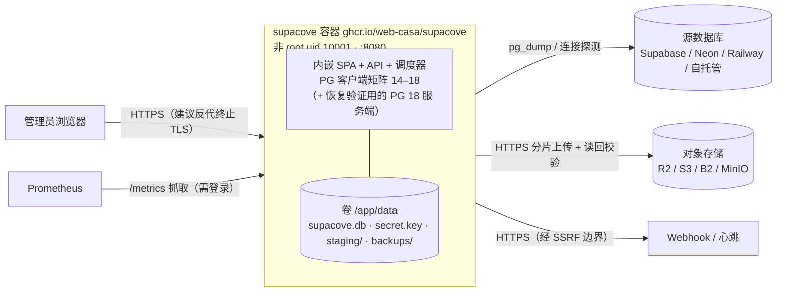
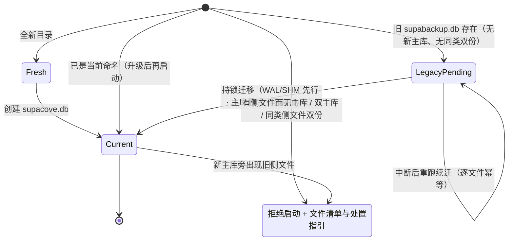

# SupaCove 部署指南

## 前提条件

- Docker 和 Docker Compose（推荐）
- 或者：发布页直接下载独立二进制（见下文「二进制发行版」）+ 本机 `pg_dump` 客户端
- 或者：Go 1.26.9+ 从源码编译（与 go.mod 一致）+ PostgreSQL 客户端工具 14–18 + age 加密工具

组件与备份/恢复/通知流程的完整图示见 [architecture.md](architecture.md)。
部署拓扑一览：



## Docker（GHCR 发布镜像）

每个 `v*` 标签在完整 CI 门禁通过后，向 GHCR 发布多架构镜像
（linux/amd64 + linux/arm64）：`ghcr.io/web-casa/supacove:<版本号>` 与
`:latest`。镜像以非 root（UID 10001）运行，自带 PostgreSQL 客户端矩阵
14–18，宿主机无需安装 pg_dump。

```bash
docker run -d -p 8080:8080 -v supacove-data:/app/data \
  ghcr.io/web-casa/supacove:latest
docker exec <容器名> /app/supacove bootstrap   # 一次性管理员 token
```

生产 compose 示例（版本建议固定到具体版本号；cookie 需要 HTTPS 反代，
见下文环境变量表）：

```yaml
services:
  supacove:
    image: ghcr.io/web-casa/supacove:latest   # 固定版本：ghcr.io/web-casa/supacove:0.1.0
    restart: unless-stopped
    ports: ["8080:8080"]
    volumes: ["supacove-data:/app/data"]
```

应用启动后访问 http://localhost:8080，用 `bootstrap` 输出的一次性 token
在 Web UI 中创建管理员账号。

不想用发布镜像也可以本地构建：`docker build --target runtime -t supacove .`。

> 仓库自带的 `compose.yaml` 是**开发环境**脚手架（内置 `SB_INSECURE_COOKIE=1`、
> 固定开发口令和本地 PG/MinIO），只用于本地试用（`docker compose up -d`），
> 不要原样上生产。

## 二进制发行版

每个 `v*` 标签在完整 CI 门禁通过后，会以**草稿 Release** 发布四个平台的
独立二进制归档（tar.gz + `SHA256SUMS`）：linux/amd64、linux/arm64、
darwin/amd64、darwin/arm64。Web 控制台、SQLite 控制面、迁移与调度器全部
内嵌在单文件里，无需 Docker；本地可用 `make release` 复现同一批产物。

```bash
# 以 <版本> / linux/amd64 为例，替换为实际标签与平台
base=https://github.com/web-casa/supacove/releases/download/v<版本>
curl -LO "$base/supacove_<版本>_linux_amd64.tar.gz" "$base/SHA256SUMS"
sha256sum -c --ignore-missing SHA256SUMS
tar xzf supacove_<版本>_linux_amd64.tar.gz
cd supacove_<版本>_linux_amd64
./supacove serve       # http://localhost:8080，数据写入 ./data
./supacove bootstrap   # 一次性管理员初始化 token
```

> **产物名时序**：GHCR 镜像与 Release 归档是标准安装渠道，`supacove` 新名
> 产物自首个改名发布版本起提供；改名前已发布的 `v0.1.0` 使用旧名
> （`supabackup_0.1.0_*`、`ghcr.io/web-casa/supabackup`）。在首个改名 tag
> 之前试用请从源码构建（`make build` / `make image`），或安装旧名产物后按
> [升级小节](#upgrade-from-supabackup) 完成升级。

### pg_dump 前提（唯一的外部依赖）

备份内核调用本机 `pg_dump`（客户端矩阵 14–18，自动匹配源库 major，
要求客户端 major ≥ 源库 major）。发现顺序：`$PATH` →
`/usr/lib/postgresql/*/bin`：

| 系统 | 安装 |
|---|---|
| Debian/Ubuntu | `apt install postgresql-client-17`；配置 PGDG apt 源可安装完整版本矩阵 |
| macOS | `brew install postgresql@17`，并把 `/opt/homebrew/opt/postgresql@17/bin` 加入 `PATH`（formula 默认 keg-only） |

可选的恢复验证（默认关闭）另需 PostgreSQL **服务端**二进制
（`SB_VERIFY_PGBIN`）。恢复端工具（`age`、`pg_restore`、`psql`）由恢复
套件在恢复机上执行，本机无需安装。控制面在无 `pg_dump` 的机器上也能
正常启动，只在真正执行备份时才需要客户端。

### systemd 示例

```ini
# /etc/systemd/system/supacove.service
[Unit]
Description=SupaCove backup control plane
After=network-online.target

[Service]
User=supacove
StateDirectory=supacove
Environment=SB_ADDR=:8080
Environment=SB_DATA_DIR=/var/lib/supacove
ExecStart=/usr/local/bin/supacove serve
Restart=on-failure

[Install]
WantedBy=multi-user.target
```

```bash
sudo systemctl daemon-reload && sudo systemctl enable --now supacove
# bootstrap 必须指向同一个数据目录：
sudo -u supacove SB_DATA_DIR=/var/lib/supacove /usr/local/bin/supacove bootstrap
```

升级：停服 → 替换二进制 → 启动（SQLite 迁移随启动自动执行，数据目录
不动）。反代 HTTPS 与 cookie 要求同 Docker 部署（`SB_PUBLIC_ORIGIN` /
`SB_INSECURE_COOKIE`）。

<a id="upgrade-from-supabackup"></a>

## 从 supabackup 升级到 SupaCove（改名须知）

首次启动时数据目录按下面的状态机迁移（六个文件：旧/新 × db/wal/shm；
只放行三种状态，其余拒绝启动并列出文件清单与指引）：




产品已由 `supabackup` 更名为 `supacove`。升级是"一次重启 + 自动迁移"，
但以下事项必须遵守（**第 1 条是硬性要求**）：

1. **先停止所有旧版本进程**——旧 server 和旧 CLI（如 `supabackup age`）
   都要停，并**关闭旧服务的自动重启**（systemd restart / Docker restart
   policy），此后只运行新二进制。旧版 CLI 不参与文件锁，运行中的旧连接
   会与文件名迁移互相干扰；新二进制虽然会在运行期间终身持有旧锁文件、
   阻止旧 server 同时启动，但被锁拒绝的旧 server 仍可能先创建一个空的
   `supabackup.db`，使新版本下次启动因新旧主库并存而拒绝——防范只能靠
   "停干净 + 禁止回涌"。
2. **Docker 升级保留原卷**：卷名只是挂载标识，继续用
   `-v supabackup-data:/app/data`，只把镜像换成
   `ghcr.io/web-casa/supacove:<版本>`。**不要**顺手换成新卷名
   `supacove-data`——新卷是空目录，启动迁移找不到旧库，效果等于重置。
   上方示例面向新安装，才使用新卷名。
3. **systemd 升级不要顺手改** `User=supabackup`、
   `StateDirectory=supabackup`、`SB_DATA_DIR=/var/lib/supabackup`：
   `SB_*` 变量名未变、数据目录不变，`supabackup.db → supacove.db`
   会在新版本首次启动时自动完成（含 WAL/SHM，已提交数据不丢）。要换
   用户或目录，按 disaster-recovery 的停机迁移步骤操作。上方 unit
   示例同样面向新安装。
4. **镜像地址已变更**：GHCR 不做重定向，请尽快把拉取地址改为
   `ghcr.io/web-casa/supacove`。改名后的**第一个**发布版本会同时把同一
   镜像镜像到旧地址 `ghcr.io/web-casa/supabackup`（让 `:latest` 跟随者
   收到改名版本），之后旧地址永久冻结、不再更新。
5. 数据文件名迁移遇到异常组合（如双主库并存）会**拒绝启动**并给出
   文件清单与处置指引；回滚步骤见 disaster-recovery.md（按目标版本
   选择恢复文件名，并隔离两组三件套）。
6. **指标与 webhook 头过渡期双名并存**：`supacove_*` 与旧
   `supabackup_*` 指标同值双发、`X-Supacove-Event(-ID)` 与旧头同值
   双发，两个正式版本后移除旧名——监控与接收方应尽快切换到新名。
   恢复套件环境变量改用 `SUPACOVE_PROFILE` /
   `SUPACOVE_ALLOW_NONEMPTY`（旧名仍有效）。

## 环境变量

| 变量 | 默认值 | 说明 |
|---|---|---|
| `SB_DATA_DIR` | `/app/data` | SQLite/暂存/密钥文件目录 |
| `SB_ADDR` | `:8080` | HTTP 监听地址 |
| `SB_INSECURE_COOKIE` | `false` | 仅限本地 HTTP 开发 |
| `SB_LOG_LEVEL` | `info` | debug/warn/error |
| `SB_LOCAL_KEEP` | `5` | 每库本地保留的 artifact 数量 |
| `SB_STAGING_QUOTA_BYTES` | `0`（不限） | 暂存目录硬配额（字节） |
| `SB_JOB_TIMEOUT` | `6h` | 单个备份任务的墙钟预算（dump+上传+回读）；超时任务按网络类失败落库。`0` 关闭预算 |
| `SB_FAILED_ARTIFACT_TTL_HOURS` | `72` | failed/canceled/interrupted 任务的本地工件保留时长（小时）；到期自动回收暂存空间。`0` 永久保留 |
| `SB_HEARTBEAT_URL` | （空） | **回退**心跳监控 URL（未单独配置心跳的库继承；共享回退端点意味着多库共同消除同一个 silence，不是每库独立监控）。单独配置某库心跳用 `PUT /api/databases/{id}/schedule`；显式禁用某库填 `"-"`。成功 ping 要求 `heartbeatPeriodHours > 0` 且快照年龄 ≤ period+grace；失败 ping 发送到 `URL/fail`。beta 无 start 信号（v1.0）。 |
| `SB_PUBLIC_ORIGIN` | （空） | 反代部署时的外部 origin |
| `SB_TRUSTED_PROXIES` | （空） | 信任的代理 CIDR 列表 |
| `SB_SECRET_FILE` | `<data>/secret.key` | 主密钥文件路径 |
| `SB_VERIFY_ENABLED` | `false` | 自动恢复验证开关（见下文"恢复验证"，须显式启用） |
| `SB_VERIFY_IDENTITY_FILE` | （空） | age 私钥文件路径（启用验证时必填，权限须为 0600） |
| `SB_VERIFY_PGBIN` | 自动探测 | 验证用 PostgreSQL 服务端二进制目录（如 `/usr/lib/postgresql/18/bin`） |

## 恢复验证（可选，默认关闭）

每次备份成功后，SupaCove 可以把密文**解密并恢复进一个一次性的内嵌
PostgreSQL 实例**，比对 manifest 声明的表数量和扩展，从而证明"这份备份
真的能恢复"。结果以状态机形式呈现在任务 API 中：
`pending → running → verified / failed / unsupported`，无法执行时是带原因
的 `skipped`。

**这是管理员显式决定才启用的功能**（ADR-004）：

- 验证进程与 SupaCove 同 UID 运行，**不是沙箱**。恢复的是备份内容本身，
  它能读写应用可读的文件。只对您信任来源的备份启用。
- 启用必须提供 age 私钥（`SB_VERIFY_IDENTITY_FILE`）。私钥进入实例内存 =
  该实例可以解密所有备份。请权衡：验证带来"可恢复性证明"，代价是私钥
  不再完全离线。
- 需要宿主机安装 PostgreSQL **服务端**（镜像已内置 PG18；裸机部署需
  `postgresql-18` 包或用 `SB_VERIFY_PGBIN` 指向现有安装）。

启用方式（compose 示例）：

```yaml
services:
  app:
    environment:
      SB_VERIFY_ENABLED: "1"
      SB_VERIFY_IDENTITY_FILE: /run/secrets/age-identity
    secrets:
      - age-identity
```

启动日志会明确打印验证模式（`restore verification ENABLED` /
`restore verification disabled`）；验证失败不会影响备份本身的提交状态，
但会如实标记在任务上。

## 初始化流程

1. `docker compose up -d` → 应用启动，自动运行数据库迁移
2. `docker compose exec app /app/supacove bootstrap` → 获取一次性 token
3. 在 Web UI 中输入 token + 管理员用户名/密码
4. `docker compose exec app /app/supacove age init > age-identity.txt` → 生成 age 密钥对
   - **将 stdout 内容保存到离线安全位置**（私钥不再显示）
5. 在 Web UI 中注册数据库（需要连接串）
6. 在 Web UI 中注册存储目的地（需要 S3 兼容凭据）
7. 测试备份：点击"立即备份" → 等待 succeeded
8. 验证恢复：下载 artifact → `age --decrypt -i age-identity.txt` → `pg_restore`

## 恢复

### 前提

- 备份密文文件（从桶下载或本地暂存目录获取）
- age 私钥文件（离线保存的）
- `age` 和 `pg_restore` 工具

### 步骤

每个成功备份都会自动生成**恢复套件**（restore.sh），包含密文校验和、
密钥指纹与平台专属指引，可在 Web UI 的任务页下载（`GET /api/tasks/{id}/recovery-kit`）。
推荐直接使用它——它会校验密文哈希、拒绝非空目标、拒绝把密码放进命令行，
并在恢复后核对 manifest 声明的表数量：

```bash
AGE_IDENTITY_FILE=/secure/age-identity.txt PGPASSWORD='...' \
  sh restore.sh "postgresql://user@host:5432/newdb" backup.dump.age
```

手动等价流程：

```bash
# 1. 解密
age --decrypt -i age-identity.txt -o restored.dump backup.dump.age

# 2. 恢复到全新数据库
pg_restore --exit-on-error --no-owner -d "postgresql://user@host/target_db" restored.dump

# 3. 验证
psql -d "postgresql://user@host/target_db" -c "SELECT count(*) FROM pg_tables"
```

注意：连接串中**不要内嵌密码**（会暴露在 `ps` 输出里），用 `PGPASSWORD`
环境变量传递。恢复失败时目标库可能已被部分写入——从空库重试。

## 安全注意事项

- **age 私钥**：丢失 = 所有历史备份永久不可读。必须离线保存。
- **主密钥文件** (`secret.key`)：丢失 = 已存凭据不可读（需重新录入），但不影响备份可恢复性。
- **管理界面**：生产部署必须走 HTTPS（设置 `SB_PUBLIC_ORIGIN` + 反代 TLS 终端）。
- **/metrics**：默认需要认证。如果暴露给监控系统，配置反代 IP 白名单。
- **多人使用**：当前为单管理员设计。API Token 可用于自动化但不支持多人 RBAC。
